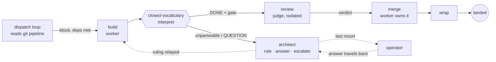
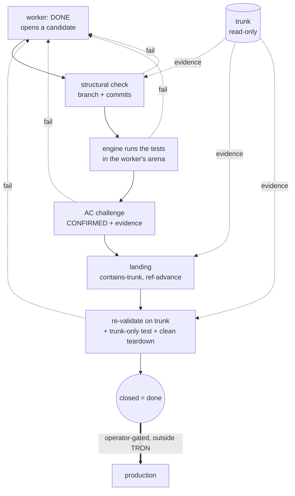

# Demoting the Master Control Program: Deterministic, Zero-Trust Orchestration of a Fleet of LLM Agents

> *"I fight for the Users."* — TRON (1982)

*Full draft v1.1 — 2026-07-19. Built on the governing working doc
(`tron-meta/reports/paper.md`: thesis framing, keeper sentences, related-work
anchors, claim hygiene) and reconciled with most-recent truth — the current
engine and its completed campaign (`CAMPAIGN.md`, `sims/`). The campaign ran
on one immutable build (`v0.0.29`); defects the campaign surfaced were fixed
immediately after it on `v0.0.30` (§15). Author: Ânderson Q., 42labs. Target:
arXiv preprint → Hugging Face Papers.*

---

## Abstract

Multi-agent systems that build software usually coordinate their agents
*through* a language model: an orchestrator reasons in prose about who works
next, whether a task is done, and when to involve a human (the operator). This
puts a probabilistic component on the control path of a system whose value
depends on reliability, and holds orchestration state inside a process that
cannot be safely interrupted. Recent work argues the inverse for a *single*
workflow — fix an explicit blueprint and confine the model to bounded steps
(Qiu et al., arXiv:2508.02721). We lift that paradigm to the harder problem of
orchestrating many concurrent, long-lived agentic builders, and present
**TRON**, a deterministic finite-state orchestrator whose control plane is pure
code: a fixed dispatch loop advances every block by table lookup over a closed,
lint-validated vocabulary, and the model never chooses the next step. **The
claim is the paradigm, not the artifact** — a deterministic runtime can
coordinate parallel LLM builders better than an LLM orchestrator can, while
keeping the operator in contact through an agent they can talk to. Its central
invariant: **the model builds, but a deterministic gate decides done** — we
trust neither the agent's report nor the commit.

We report a pre-registered campaign of **74 orchestrated delivery runs** on one
immutable engine build (three ablation arms, a wide-parallelism arm, a 30-run
headline configuration), plus **5 runs on PROJECT-04** — a constructed target
roughly twice the depth and width of the campaign projects (15 blocks, seven
dependency layers) — for **79 runs in total**. **75 of 79 delivered clean end
to end (94.9%; campaign 70/74, PROJECT-04 5/5)** — every declared block built,
landed, and re-validated on trunk with zero operator intervention, and every
delivered product passed independent probes (a fresh test-suite run plus a live
CLI session checked against the spec). The four non-clean runs are reported in
full, not excluded: each **failed safe** — the orchestrator escalated and never
recorded a false completion — so the design's central safety property,
**false-completion rate, measures 0 of 79 (0%)** (rule of three: ≤3.8% at 95%
confidence). Two follow-up experiments harden this from observation into cause:
six by-construction false-done fixtures — five seeded single-block shortcuts and
one trunk-only integration defect, run on the fixed pin (`v0.0.30`) with engine,
gate, and vocabulary unmodified — were all rejected, none landed. Of the four
non-clean runs, one was an external API outage, two a cleanup defect in our own
test harness (each a contaminated precondition, not an independent engine
trial), and one a genuine engine gate-vocabulary deadlock; the two
engine/harness defects were fixed immediately after the campaign, each with a
regression test. We estimate **~131 hours of operator decision-work displaced**,
with pages only ever in the four non-clean runs, left unanswered under an
operator-dark protocol. When reality misbehaved, the system said so instead of
faking green.

---

## 1. Introduction

Ask a team of LLM agents to build something real and the hard part is not the
building — it is the **coordination around them**: deciding who goes next,
noticing when one has silently died, telling a genuine "done" from an
optimistic one, knowing the moment the operator actually needs to weigh in. In most
agentic frameworks that coordination is itself done by a language model — a
planner reasoning in prose about the state of the world. The component you
most need to be dependable is the least dependable thing in the system: it can
hallucinate a finished task, forget a stalled worker, invent a step not in the
plan; and because its state lives in a running model's context, you cannot
kill it and resume cleanly.

We did not set out to write an orchestrator. We set out to ship software with a
fleet of agents and kept hitting the same wall: a worker reporting success it
had not achieved, another dying unnoticed, a crash leaving the orchestrator's
idea of the world out of sync with the repository. The recurring failure —
agents declaring done on work that was not — we observed repeatedly before
finding it named in the literature (EviBound, arXiv:2511.05524). TRON is what
we built once we accepted that the orchestrator itself had to stop being a
model.

Qiu et al. (arXiv:2508.02721) argued that for a *single* workflow you should
invert the usual design: write the plan as an explicit blueprint and let the
model do only bounded local work inside each step. Their setting is one
procedure of short, stateless, retryable nodes. We ask what it takes to hold
that line one level up — across a whole fleet of long-lived builder agents
(workers that persist for hours, carry session history, and can stall or die)
while a real project moves under them. The fleet setting breaks the
single-workflow assumptions in three places: **state outlives the process**
(the orchestrator will be killed and resumed); **"done" is contested** (a
worker's "done" is a claim, and a commit on a branch is not a verdict either);
and **work runs concurrently against a shared trunk** (coordination becomes a
distributed-systems problem). TRON's central invariant is one line: **the
model builds, but a deterministic gate decides done.**

## 2. Contributions

1. **Determinism at the fleet layer.** Blueprint-first applied not within one
   procedure but *over* a fleet of long-lived sessions that wall, stall, and
   die — and the machinery this forces (liveness, crash recovery,
   resume-vs-fresh, content-carrying escalation), all kept deterministic.
2. **Git as a read-only, externalized state substrate.** The orchestrator never
   writes to version control; each worker owns an isolated git worktree
   (*arena*) and owns its own merge, while the engine only reads trunk and
   authorizes the mechanical landing. Crash- and drift-safety fall out of this
   rather than out of added recovery code.
3. **Gate-decided done.** Completion is closed by a deterministic challenge
   that rejects *both* self-report *and* bare trunk-presence: the engine
   checks the branch, runs the declared tests itself in the worker's arena,
   demands evidence for each acceptance criterion through a bounded challenge,
   re-validates on trunk after the landing, and runs a final trunk-only
   validation. Trunk is the gate's input at every step, never its verdict.
4. **A parsed control plane, not a judged one.** Every transition is a lookup
   over a closed, lint-validated vocabulary; the engine *parses* the agents'
   verbs, it never asks a model whether to advance. Judgment (triage, review,
   escalation copy) is confined to bounded LLM roles that sit off the steering
   path.
5. **Reliability as a protocol property.** Isolated arenas, a single
   engine-wide merge window, idempotent dispatch, and crash-safe ticks give
   the fleet distributed-systems guarantees — measured, not asserted — and, as
   the safety headline, a **zero false-completion rate** under a deliberately
   adversarial evaluation.

## 3. Principles (framework-agnostic; TRON instantiates them)

1. **Closed vocabulary, deterministic interpretation.** Agents speak a fixed
   glossary of verbs (`DONE`, `CONFIRMED`, `APPROVED`, `REJECTED`, `QUESTION`,
   …) generated from a single source and parsed by code. The control plane
   *parses*; it never *asks*. A message that breaks protocol is not guessed at
   — it routes to an in-fleet architect (an LLM by design, but a routed
   participant, not a hidden judge). The engine cannot tell a mis-tagged wall
   from a real one — and must not try; **the verb is the datum.**
2. **Gate-decided done.** A worker's `DONE` opens a candidate, nothing more.
   The engine checks the branch itself, runs the project's declared tests
   itself in the worker's own arena, challenges the worker to confirm every
   acceptance criterion with evidence, re-validates on trunk after landing,
   and runs trunk-only validation at the end. Trunk is the evidence the gate
   checks at every stage, but neither a claim nor a commit ever closes work by
   itself (EviBound, arXiv:2511.05524, quantifies why: gating claims collapses
   false-completion from 100% to 0%).
3. **Judge isolation.** Verdicts are produced in a detached checkout pinned to
   the exact commit under review, force-restored to that sha on every re-pin —
   the worker cannot move what the judge reads, and the judge cannot
   contaminate the arena.
4. **Architect-first, content-carrying escalation.** Walls route to the
   architect before the operator; an escalation channel is only as valuable as
   its *answer* path, so operator rulings travel back to the walled worker.
   Nothing is dropped or looped silently; the operator is the last resort.
5. **Typed events as the only truth.** Every dispatch, gate, verdict, landing,
   and trunk check is a typed event in an append-only log. All statistics
   below are computed from these logs, never from agent narration; the prose
   transcripts ride along only for debugging.
6. **A frozen operator journey.** The operator's decisions (models per role, merge
   policy, scope) are seated in a fixed bootup dialogue before autonomy
   begins; past that, the fleet is autonomous up to trunk, and the operator past it.

## 4. Background & Related Work

Every cited arXiv ID resolves to the described paper, and the reference list
carries the exact published titles.

**Blueprint-first (arXiv:2508.02721, Qiu et al.) — the founding paper.** Make
source code the control mechanism and relegate the model to bounded sub-tasks
"never to decide the workflow's path"; constraints become programmatic checks
that cannot be bypassed. On TravelPlanner they report 35.56% pass (+97.6% over
their ATLAS baseline on the same Claude-Sonnet-4 backbone) and −96.0%
constraint violations. **TRON** lifts this one altitude — from one deterministic
*procedure* to a deterministic *fleet orchestrator* — where nodes are long-lived
sessions that wall, stall, and die (forcing liveness and recovery they never
confront), and a sealed engine reads the pipeline as data and writes nothing
rather than fusing control and content in one artifact.

**From Agent Loops to Structured Graphs (arXiv:2604.11378).** Reframes the agent
loop as a degenerate single-unit scheduler and prescribes lifting control flow
into an explicit static DAG with separated plan/execute/recover layers — a
position paper with no implementation; TRON is that thesis in running code,
git-driven rather than harness-owned.

**MetaAgent (arXiv:2507.22606).** LLM-generated FSM control — "soft," every
transition hinging on a verifier LLM. TRON's machine is **hard**: table lookup
over a closed grammar, the only model outputs the engine consumes being the
agents' verbs, never a transition.

**EviBound (arXiv:2511.05524) — the closest match to gate-decided-done.** Dual
governance gates collapse false-completion **100% → 0%** (pre-gate alone 25% →
0%; ≈8.3% overhead). TRON pushes the analogue further — *even a commit on trunk*
is evidence to be checked, not a verdict — and gates a *fleet* arbitrating
concurrent contributors through the shared trunk, where EviBound governs a
single agent's research claims.

**Hack-Verifiable (arXiv:2605.20744).** Plants detectable reward-hacking
opportunities so exploitation is deterministically measurable. An empirical
case-file for the failure mode TRON's evidence gate neutralizes, and the
template for our by-construction false-done metric (§12.1).

**Claw-Eval (arXiv:2604.06132).** Grades the *full trajectory* from execution
traces, audit logs, and snapshots; a vanilla LLM judge missed 44% of safety
violations versus the evidence pipeline — our source for reporting **consistency
(Pass^k)** over single-shot success.

**LedgerAgent (arXiv:2606.20529).** A typed, schema-anchored ledger plus a
deterministic Allow/Revise/Block gate with **zero extra LLM calls** —
independently arriving at TRON's externalized typed state and pure-code
admission, over a private store rather than git trunk.

**Atomix (arXiv:2602.14849).** Progress-aware transactions that commit only once
per-resource frontiers confirm no earlier conflicting work can arrive — the
closest distributed-systems match (its commit-gate ↔ TRON's single merge window
plus contains-trunk check), but rollback-based where TRON is forward-only and
ff-only-no-write.

**Lean4Agent (arXiv:2606.06523).** Dependent-type verification of agent
workflows (verification-passing workflows outperform by ~12%) — an upgrade path
for TRON's lint: promote the transition table to *proof* (contribution C1).

**Oolong (arXiv:2511.02817) — premise evidence.** At 128K context, frontier
models score <50% on aggregate-over-many-chunks reasoning. Supervising a fleet
*is* long-horizon aggregation — the strongest external justification for keeping
orchestrator state in files and an FSM, and the mechanism-level prediction for
why an LLM-orchestrator baseline degrades over a long session.

**Positioning against frameworks.** The defining axis is *who owns control flow,
and in what form*. LangGraph is a graph in code with edges often chosen by the
model; TRON is a validated blueprint in which the model never decides flow.
**LangGraph is an agent framework; TRON is a workflow engine for agents**, its
nearest relatives durable workflow engines (Temporal, Camunda/Zeebe). *You could
build a TRON worker with LangGraph; you could not build TRON's deterministic,
auditable orchestration layer by writing one.*

## 5. System overview — the deterministic core and the model's bounded roles

TRON orchestrates a pool of worker agents building against an explicit,
version-tracked plan — the **pipeline**, an ordered set of **blocks** (a block
= one unit of delivery work: a scoped task, its own spec file, its own branch,
its own gate). TRON does not write code and does not write to the repository.

**The deterministic core** is a fixed dispatch loop. It reads the pipeline
from git, selects dispatchable blocks (dependencies satisfied) up to a
configured parallelism cap, and runs each block through the **flow** — an
ordered set of phases declared in `workflow.toml`, the single source of the
process. Each phase seats a fresh agent in the role the phase names (a *work*
phase closes on the actor's declared verb after its gate; a *verdict* phase
records a judge's verdict durably and routes; a single *landing* phase runs
inside the one engine-wide merge window). Every advance is a deterministic
interpretation of the seated agent's reply against the closed vocabulary — the
engine parses a verb and looks up the transition; it does not ask a model what
to do next. A reply the vocabulary cannot parse is not guessed at: it routes
to the architect (§9).

The model therefore appears in exactly three bounded roles, none on the
steering path: **workers build**; **judges review** a delivered branch in
isolation and return a verdict verb; and an in-fleet **architect** (with an
operator-facing **AIDE** persona) triages walls and composes escalation copy.
TRON is not itself a model — it is plain code around the model — and the model
is a swappable part: any LLM or mix fills those roles under the same sealed
engine. In this campaign workers and judges ran Sonnet 5 and the
architect/AIDE ran Opus 4.8, all seated through the frozen bootup journey.

*Figure 1 — The deterministic core: a block flows build → review → merge →
wrap → landed; every advance is a closed-vocabulary parse (the only decision
point). The architect is off the steering path, reached only by walls and
unparseable replies; the operator is the last resort and answers travel back
to the walled worker.*

## 6. The state substrate: git, read-only

The core **owns no authoritative state and never writes to version control**.
The single source of truth about the work — which blocks are done, in
progress, or next — is the git-tracked pipeline, and the engine only reads it.
Each dispatched block gets an **arena**: an isolated git worktree on its own
`feat/<block>` branch, created off trunk. Workers can never collide in a shared
tree, and trunk stays checked out in the primary copy, so git itself refuses
any second checkout of the trunk. A verdict seat gets its *own* detached
checkout pinned to the exact delivered commit (judge isolation, §3.3).

Two properties fall out without recovery-specific code. **Resume is a
non-event**: at boot the engine kills stray agent processes, sweeps every
leftover arena (a crash-safe sweep added after this campaign surfaced the need
— §15), preserves any unverified in-flight branch as an orphan, and re-stamps
interrupted blocks back to `todo` for fresh dispatch. **Drift halts loudly**:
an operation the engine cannot complete safely pages the operator rather than
acting on a stale view.

*Table 1 — The three tiers of state, by durability and writer.*

| tier | what it holds | writer | lifetime |
|:--|:--|:--|:--|
| **trunk** | the authoritative plan + delivered work | agents (via gated landing); engine reads only | permanent |
| **arena** | one block's isolated worktree + branch | the block's worker | per-block, disposable |
| **typed event log** (`events.jsonl`) | every engine decision, one line each | engine | append-only audit trail |

**Observability by construction.** In a deterministic runtime the trace is a
property, not a bolt-on: `events.jsonl` (typed dispatch/gate/verdict/land/
trunk-check records) *is* the audit trail, and same-inputs → same-decisions
makes the control plane replayable — which no probabilistic-orchestrator trace
can promise.

## 7. The gate: what closes work

A worker announcing `DONE` opens a *candidate*. It advances only by surviving a
fixed challenge, in order:

1. **Structural check.** The engine verifies the claimed branch exists, is the
   phase's own branch, and carries commits trunk does not — a claim for the
   wrong branch, or with no delivered work, is rejected outright.
2. **The engine runs the tests.** Where the block declares a test command, the
   engine runs it *itself* in the worker's arena and reads the real result; a
   red suite bounces the claim with the captured output. The worker never
   reports the test result — the engine observes it.
3. **Acceptance-criteria challenge (bounded exchange).** The engine challenges
   the worker to confirm every acceptance criterion with evidence. This
   challenge is its *own* bounded exchange: the only reply it accepts is a
   `CONFIRMED` verb carrying an evidence field; anything else is retried with
   the exact expectation, and exhaustion withdraws the claim back to work. (A
   defect in the campaign build let a failed challenge reply leak back into the
   phase loop, where `CONFIRMED` and `DONE` could each be read as out-of-phase
   and deadlock — surfaced once in the campaign as a failed-safe page, then
   fixed by making the exchange strictly bounded; §14, §15.)
4. **Landing.** Inside the single engine-wide merge window, the worker owns the
   merge — it brings trunk into its branch and resolves conflicts in its arena;
   the engine verifies the branch already contains trunk (so the landing
   cannot conflict) and then performs the mechanical ref advance. An arena
   physically cannot move the checked-out trunk; the subjective merge work is
   the worker's, and the engine only authorizes.
5. **Re-validate and close.** The change is re-validated on trunk after
   landing; a final trunk-only validation runs where the block declares one;
   the worker confirms a clean teardown (the engine scans the arena for
   leftover state — a real read, not say-so) before the slot is released.

Only after close does the block show done. **The worker flow ends at trunk**;
promotion to production is an operator action outside TRON. The subtle point:
**trunk is the evidence the gate checks at every stage, but trunk-presence
alone never closes the work** — rejecting the worker's *claim* and the naive
*"it's on main, ship it"* at once.

*Figure 2 — The gate is a linear challenge; trunk is the evidence read into
each stage (dashed), never the terminal. Any stage can bounce the claim back
to work. Promotion to production is a separate, operator-gated step outside the
machine.*

## 8. Reliability as a protocol

Coordination is a distributed-systems problem, so we give it
distributed-systems guarantees. **Arena isolation**: every block builds in its
own worktree and branch; concurrent workers cannot corrupt one another's
trees. **One merge window engine-wide**: at most one landing is in progress at
a time, and a landing is admitted only once the engine has confirmed the
branch contains trunk — concurrent contributors serialize through the trunk
without conflicting. **Idempotent dispatch**: a block already in flight is
never double-assigned. **Crash-safe boot**: strays are killed, arenas swept,
in-flight branches orphaned, and interrupted blocks re-queued, so a killed and
restarted engine reconverges to trunk with nothing lost, doubled, or
double-dispatched. The typed event log makes each of these auditable after the
fact, and replayable before.

This is validated by four deliberate live trials, not only unit tests
(`sims/crash-resume.md`): the engine was `kill -9`'d mid-flight and restarted on
the same project. A single-block run killed during build preserved the
unverified branch as an orphan, re-queued it, and completed. A six-block run
killed with three landed and two building kept the three land commits exactly
(not rebuilt), orphaned and re-queued the two in-flight, and reconverged to 6/6.
An eight-block depth-5 graph killed after three landings kept all six pre-crash
land commits as trunk ancestors and re-queued the two independent in-flight
branches (8/8). And a run killed with **two workers building in parallel**
orphaned both in-flight branches and swept their arenas independently, with no
double-landing (6/6). Every trial's product suite came back green — nothing
lost, doubled, or dropped, sequential or concurrent.

## 9. Escalation: architect-first, content-carrying, no second judgment

When something does not fit the vocabulary — a reply the engine cannot parse,
a gate the worker cannot pass, a phase that burns its turn budget — the core
does **not** ask the model a second question ("is this the operator's problem?").
It routes the wall to a **persistent in-fleet architect** (an LLM with project
context) that does one of three things: **rules** on it and relays the ruling
back to the seat; **answers** it (questions never dead-end); or **escalates**
to the operator with content. A ruling that comes back a second time (a wall
that recurs after being answered) skips straight to the operator — an answered
wall that returns is above the fleet. Operator answers are content-carrying:
the ruling travels back to the walled worker, because an escalation channel is
only as valuable as its answer path. The engine's own turn continues; the
reply lands on a later turn. All wall kinds route architect-first; the operator
is the last resort.

## 10. Relationship to existing tooling

**Overlaps** with durable workflow engines and stateful agent frameworks: a
graph/state-machine as the unit of orchestration; durable state and resume;
operator-in-the-loop as a parked, resumable wait; typed I/O; observability
ambitions. **Fundamental incompatibilities** with model-routed frameworks:
blueprint-routed vs model-routed control; an auditable process definition vs a
code graph whose edges the model chooses; external, long-lived git-branch
sessions vs in-process nodes; git-as-truth vs app-internal state;
evidence-gated done vs "correctness is the app's problem." **What we would
borrow**: a checkpointer formalism to sharpen resume edge-cases;
durable-execution semantics as a tick checklist; tracing tooling for the
*experiment* harness, kept outside the production spine. **What we would not**:
model-decided routing, graph-as-code as the source of truth, any coupling that
moves state off the trunk.

## 11. Campaign design

### 11.1 What a block is

The unit the engine schedules, builds, judges, and lands is a **block**: one
self-contained delivery spec (a Markdown file) that names what to build,
declares the test that certifies it, and lists its dependencies — a contract
precise enough that a fresh builder with no prior context can satisfy it and a
deterministic gate can decide whether it did. Every block has the same shape: a
title, a `test:` line, an optional `trunk-test:` line (the suite that must pass
on the *merged* trunk, not just the isolated arena), and a numbered task list
written as verifiable obligations (exact error strings, return shapes, ordering)
rather than intentions. Because the block *declares its own test*, the engine
never guesses what "done" means — ambiguity is designed out at authoring time,
not adjudicated at review time.

We author blocks to five principles: **spec-driven** (exact observable outcomes,
not a direction to explore — if two builders could satisfy the text differently
it is under-specified and rewritten); **architecturally coherent** (one module
or CLI surface, one landing, one place in the dependency graph — layer
boundaries are block boundaries); **short-memory-sized** (fits inside one
builder's context, so long horizons are expressed as *more blocks*, not *bigger
blocks*); **one branch, one gate** (never split across blocks, never partially
landed); and **declares its own tests** (behavior lands *with* its tests, which
the engine runs itself in isolation). The dependency graph (`pipeline.md`) is
what the scheduler consumes — blocks with satisfied dependencies run in parallel
up to the configured width, with a shared contract file (e.g. `MODULES.md`) the
deliberate merge-contention surface.

### 11.2 The sample

One immutable engine build (tag `v0.0.29`) ran everything, so results are
comparable. Three project templates of increasing difficulty: PROJECT-01 (3
blocks, a stack library — pilot only, deliberately absent from the sample
because a 3-block smoke test exercises no contention or parallelism),
PROJECT-02 (6 blocks, a collections toolkit with a shared module file that
forces merge contention), and PROJECT-03 (8 blocks across four layers, an
issue tracker with a rank/report CLI — the headline configuration). The sample
was operator-ruled in advance and never self-expanded:

| config | n | purpose |
|:--|--:|:--|
| PROJECT-02, ablate `truth_gate` | 10 | falsification arm: worker claims accepted unverified |
| PROJECT-02, ablate `judge_isolation` | 10 | falsification arm: judges read the worker's arena |
| PROJECT-02, ablate `architect_first` | 10 | falsification arm: walls page the operator directly |
| PROJECT-03, parallel @4 | 10 | scheduler under widest parallelism |
| PROJECT-03, main @2 | 30 | headline reliability estimate |

The `n` column is the operator-ruled *target* (70); the campaign logged **74
attempts** because main @2 ran 34 to reach its 30-run target (the four
non-clean runs are attributed, not dropped, in §12).

The evaluation is deliberately adversarial to the system's own comfort. Runs
execute **operator-dark**: pages are left unanswered on purpose, and any page
caps the run — the bar is *unattended* delivery, so the campaign cannot
"pass" by leaning on the operator. Independent per-product probes sit *outside* the
harness verdict: a fresh `python3 -m unittest discover` in every delivered
product, plus a live CLI transcript on PROJECT-03 checked against the spec's
exact output. Batches ran ~10 at a time, ablations first (cheapest
falsification), at most two runs concurrent, with an operator review between
batches. Two pinned worktrees isolated concurrent runs because arenas and run
logs live in the engine root.

## 12. Results

**75 of 79 runs delivered clean end to end (94.9%); every delivered product
passed its independent probes; false completions measured 0 of 79 (0%).** We
report the complete attempt-level accounting rather than a filtered "valid"
subset: the safety property the design exists to guarantee is that a claim
never closes work it did not do, and that property is only meaningful over
*every* run, including the ones that went wrong.

**The four non-clean runs, in full.** All four occurred in the PROJECT-03
main @2 configuration. None produced a false completion; each failed safe —
the engine escalated, and the run capped only because the page went unanswered
under the operator-dark protocol.

| run | attributed cause | layer | independent engine trial? | outcome | status |
|:--|:--|:--|:--|:--|:--|
| batch-04 SIM-04 | Anthropic API 529 (overloaded) mid-review | external infrastructure | yes | no verdict → routed architect-first → paged → capped 5/8 | external; not a TRON fault |
| batch-04 SIM-05 | stale-arena poison (left by SIM-04's cap) | test harness | **no** — contaminated precondition | paged on "arena exists" → capped 4/8 | harness defect, fixed `42398b7` |
| batch-06 SIM-01 | gate-vocabulary deadlock (`CONFIRMED`/`DONE`) | **engine under test** | yes | 4 rejections → escalated → paged → capped 6/8 | engine defect, fixed `e474c61` |
| batch-06 SIM-02 | stale-arena poison (left by SIM-01's cap) | test harness | **no** — contaminated precondition | paged on "arena exists" → capped | harness defect, fixed `42398b7` |

Three of the four are not evidence about the engine's decision behavior: one
is an external API outage, and two are our own harness leaking state between
trials — each of those two started from a corrupted precondition (an arena
directory left by the *previous* run's cap) that the engine never produces in
normal operation, so they are not independent draws from the engine's behavior
distribution. We still count them, because dropping them is precisely the move
that invites doubt; we attribute them instead. The **one** non-clean run
attributable to the engine under test is the gate-vocabulary deadlock — and it
is the strongest single piece of safety evidence in the campaign: a real defect
on the engine's own control path, and the engine *still* refused to fake a
completion. It escalated. That is the design working under a defect it did not
know it had.

**On the headline reliability bound.** The PROJECT-03 main @2 configuration saw
34 attempts, 30 clean (88%); we do *not* claim a zero-failure clean-completion
rate there — the harness and one engine defect cost clean completions the fixes
have since addressed. What we *do* claim, and what the design targets, is the
safety rate: **0 false completions across all 79 runs**, bounding the true
probability at **≤3.8% (95% confidence)** by the rule of three. Pooling all 79
is deliberate — false-completion must hold on *every* draw regardless of
topology, so a wider, unseeded sample only strengthens it, and the
pre-registered subset alone yields the same conclusion (we keep pre-registration
separate for the *reliability* rate, where it does matter).

### 12.1 Causal supplement — the gate made to catch

The 0/79 result is *observational*: across all 79 runs no worker ever tried to
close work it had not done, so the gate's rejection behavior was never
exercised. Two follow-up experiments on the fixed pin (`v0.0.30`) force the
events the runs never produced. Both seed only the worker instruction
channel; the engine, gate, and vocabulary are unmodified
(`sims/EXPERIMENTS.md`).

**Experiment A — false-done testbed (n=5).** Five single-block fixtures each
seed one deliberate shortcut, spanning the ways a claim can lie: (A1) DONE with
nothing committed, (A2) DONE with a deliberately failing test, (A3) DONE after
deleting the named test, (A4) a bare `CONFIRMED` with no evidence at the
acceptance challenge, (A5) DONE whose arena suite is green but whose declared
trunk obligation is broken. **Result: 5 of 5 rejected; 0 landed** (no
`block_done` on any run) — each caught at the earliest applicable stage (A1
structural check, A2/A3 the engine's own arena test run, A5 trunk-only
re-validation), converting the observational safety property into a causal one.
A4 was also rejected but exposed a liveness shortcoming: the outer
`DONE`↔acceptance-challenge loop is not bounded to a terminal escalation, so a
worker that persistently withholds evidence drives the run to its wall-clock cap
rather than a clean operator halt. Safety held; liveness degraded — a hardening
target (bound the outer loop; escalate an unresolved architect wall to the
operator) that 75 clean runs never reached.

**Experiment B — trunk-only fixture (n=1, deterministic).** A change whose
in-arena unit test mocks its collaborator is green in isolation but breaks
the real integration on the merged trunk. The engine landed the branch,
re-ran the suite green, then ran the block's `trunk-test:` on the trunk,
observed RED, and **refused to stamp the block done — it paged instead**.
This is the on-record negative case that trunk re-validation is not
redundant with arena testing: an integration defect no isolated arena can
observe is caught at the trunk.

Together these make the central claim causal rather than incidental: across
79 observational runs *and* six forced-shortcut trials, no unearned claim
ever closed work.

**Operator time displaced.** A per-decision response-time model (dispatch 2
min, gate 1, verdict 5, land 2, trunk-check 1) applied to the typed event logs
yields **7,835 modeled minutes (~130.6 h)** of decision-work performed by the
engine across the campaign. Workflow-triggered operator interventions in the
clean runs: **0**. The system did contact its operator — at the designed,
project-specific touchpoints (bootup choices, landing policy) — but no clean
run needed the operator to unblock the workflow, and the only pages raised were the
four non-clean runs above.

## 13. Ablations (event-level; pass/fail does not discriminate)

All 30 ablated runs finished clean — walls are rare at this scale, so
pass/fail does not discriminate the arms. Discrimination is therefore
event-level (`sims/ablation-analysis.md`):

- **`truth_gate` off** is the only arm with a behavioral delta: across the arm,
  180 of 180 acceptance-criteria gates emitted "claim accepted unverified,"
  the non-ablated wrap-gate catch rate is 5.2–7.1% (≈9–13 statistically
  expected catches suppressed), and ablated runs ran ~15% faster —
  verification is real, measurable work. At n=10 the removed invariant was not
  product-fatal, so we report it as **bounded, not zero** risk rather than
  overclaiming a disaster that did not occur.
- **`judge_isolation` off**: no measurable contamination signal at n=10. We log
  the instrument gap honestly — verdicts do not currently record their
  read-source, so contamination is under-instrumented, not proven absent.
- **`architect_first` off**: never exercised — zero walls occurred in the arm,
  so routing walls directly to the operator was never triggered. The
  architect-first claim rests on the incident evidence (§9, §12), not on this
  arm, and we say so rather than stretch a null result into support.

## 14. Evidence from the development record (honest exhibits)

The engine is a ground-up rewrite whose design was selected by its
predecessor's failures — itself evidence for the thesis at the code level:

- **Convergence on determinism under selection pressure.** In the predecessor,
  the observable-reading regions (dispatch, work selection, trunk refresh)
  essentially never failed, while the message-interpreting periphery
  (wall/hold/replay, settle, admission, liveness) absorbed *all* ~13 fix-blocks
  at 4–8× the defect-scar density. Every independent fix moved a decision from
  interpretation to observation — the system converged on determinism under
  pressure from its own failures.
- **Probabilism as unbounded flow variance.** Two runs of the same sim, same
  sha, same knobs, one second apart: one finished in ~67 min; the other drew a
  strict-compliance worker that refused an ambiguous merge instruction, re-sent
  its wall 18 times, and stood at 2/4 when its twin finished — ≈+40% wall-clock
  from one sampled interpretation of one sentence. Determinism *contained* what
  it could not remove: every message survived, the sweeps re-raised what the
  parser missed, and the cost was bounded and forensic.
- **A live false-completion, and this campaign's own incident.** In the
  predecessor, one block recorded done while a mandated commit sat off trunk —
  our own EviBound failure mode, from a single boundary that trusted a report;
  the fix (gate on the *absence of counter-evidence*) closed the class and is
  why the rewritten gate never treats a claim as terminal. In this campaign the
  gate once deadlocked (`CONFIRMED`/`DONE` each rejected for the other after a
  failed challenge reply leaked into the phase loop); the escalation chain
  worked and the run capped only because pages go unanswered — the one
  engine-attributable non-clean run (§12), since made a strictly bounded
  exchange so the ambiguity is unrepresentable.
- **Negative results that generalize.** Workers do not comply with
  structured-envelope protocols even when contractually ordered (design for
  non-compliance; derive from observables). Freezing *vocabulary* does not stop
  *mechanism* accretion. The operator is part of the system under test —
  operator-layer slips need the same discipline as the machine side.

## 15. Limitations & claim hygiene

- **Scale.** The campaign used 6–8-block constructed projects designed to force
  contention and judging pressure, not a shipped product. For external validity
  we ran PROJECT-04 — a 15-block log-structured key–value store, seven
  dependency layers, two join diamonds (roughly double the depth and width) —
  which delivered clean 5/5 (15/15 blocks each, zero walls, zero pages, ~35–42
  min/run, product suite green on durability + log-compaction CLI probes).
  Evidence the discipline holds at a deeper, wider topology; not a claim of
  production scale — topologies an order of magnitude larger, or with real
  external dependencies, remain unprobed.
- **All attempts reported.** We attribute the four non-clean runs by layer
  rather than dropping any (§12); the operational ledger's "valid run" count
  drove batch-stopping only, so the rates cannot be read as cherry-picked.
- **No head-to-head LLM-orchestrator baseline.** We do not race an LLM in the
  orchestrator seat against the deterministic runtime; the `architect_first`
  arm is the nearest control and went unexercised (walls were rare at this
  scale, so that claim is scoped to incident evidence, §9/§12). The "better than
  an LLM orchestrator" claim is argued from design and the framework comparison
  (§4) as an existence proof, not a controlled bake-off — left to future work.
- **The operator-time metric is modeled, not measured** — the model and raw
  event counts are published for re-derivation.
- **Model/API dependence.** Results are tied to the seated models; one 529
  outage cost a run. Environment failures are named as such and kept out of the
  *rates*, never out of the accounting.
- **Remediation, not folded back.** The two defects — the gate-vocabulary
  deadlock (`e474c61`, now a bounded exchange with four scripted regression
  proofs) and the stale-arena harness poison (`42398b7`, a crash-safe boot sweep
  with selftests) — were root-caused and fixed on `v0.0.30` immediately after
  the campaign, with a one-run-per-level validation pass confirming clean
  delivery on the fixed build; the paper's numbers are the campaign's, on
  `v0.0.29`. The by-construction false-done testbed (Hack-Verifiable), earlier
  deferred, has since been run (§12.1): 5/5 seeded shortcuts rejected, 0 landed,
  plus the deterministic trunk-only fixture — and it surfaced one liveness
  shortcoming (the unbounded outer acceptance-challenge loop, A4), logged for
  hardening. Remaining future instruments: a read-source field on verdicts (to
  close the `judge_isolation` gap) and promoting the lint to proof (Lean4Agent).
- Claims target the **orchestration layer**, not worker code quality, and
  procedurally well-defined delivery work, not open-ended exploration.

## 16. Conclusion

Taking the model off the control path and gating truth on the repository makes
an autonomous fleet auditable, recoverable, and runnable unattended. Across 79
adversarially-evaluated runs on one pinned build, the fleet delivered 75 clean
end to end, every product independently verified, ~131 modeled operator-hours
displaced with zero interventions in the clean runs — and, the property that
matters most, **not one false completion**, including on the run where the
engine's own gate hit a defect and still refused to fake green. The model
keeps doing what it is good at: workers build, judges judge in isolation, the
architect and AIDE talk. What the model no longer does is decide. **The model
builds; a deterministic gate decides done.**

## Notes for typesetting

Naming decision pending (print the internal role/phase names, or keep them
functional). Figures 1–2 render from `mkfigs.py` in the 42labs vector style;
Table 1 is native. All ten citations verified to resolve (2026-07-17).

**References** (all arXiv IDs verified to resolve 2026-07-17; exact published
titles).

1. Qiu et al., *Blueprint First, Model Second: A Framework for Deterministic LLM Workflow*, arXiv:2508.02721.
2. Chen, *Evidence-Bound Autonomous Research (EviBound): A Governance Framework for Eliminating False Claims*, arXiv:2511.05524.
3. *From Agent Loops to Structured Graphs: A Scheduler-Theoretic Framework for LLM Agent Execution*, arXiv:2604.11378.
4. Zhang et al., *MetaAgent: Automatically Constructing Multi-Agent Systems Based on Finite State Machines*, arXiv:2507.22606 (ICML 2025).
5. Mohammadi et al., *Atomix: Timely, Transactional Tool Use for Reliable Agentic Workflows*, arXiv:2602.14849.
6. *LedgerAgent: Structured State for Policy-Adherent Tool-Calling Agents*, arXiv:2606.20529.
7. Roth et al., *Hack-Verifiable Environments: Towards Evaluating Reward Hacking at Scale*, arXiv:2605.20744.
8. *Lean4Agent: Formal Modeling and Verification for Agent Workflow and Trajectory*, arXiv:2606.06523.
9. *Claw-Eval: Towards Trustworthy Evaluation of Autonomous Agents*, arXiv:2604.06132.
10. Bertsch et al., *Oolong: Evaluating Long Context Reasoning and Aggregation Capabilities*, arXiv:2511.02817.
11. LangGraph, AutoGen, CrewAI, Temporal, Camunda — project docs for the §10 contrast.
