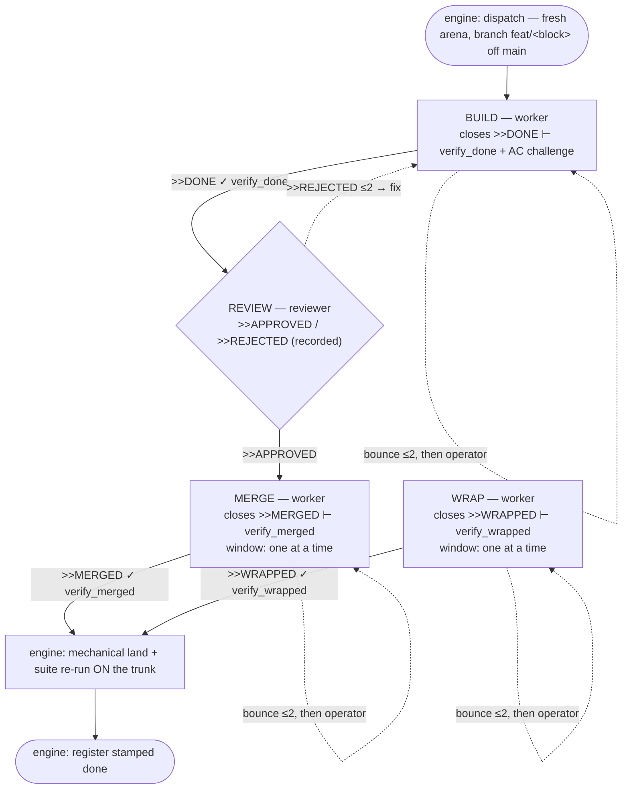

# tron-reborn — the workflow

> GENERATED from `workflow.toml` (the single source of the process).
> Edit there, then run `python3 workflow.py --write`. Selftests fail
> when this file is stale; the engine lints the same table at boot
> and refuses to run an unsound flow.

Process: **build-review-merge** (version 1) — limits: 40 turns/phase, 2 review cycles, 2 gate bounces (each cap ends at the operator), 2 blocks in flight.

## Phases

| Phase | Kind | Seat | Opens with | Closes on | Verified by | Pass → | Reject/bounce |
|:--|:--|:--|:--|:--|:--|:--|:--|
| build | work | worker | `worker_assign` | `>>DONE` | verify_done + AC challenge | review | bounce `gate_fail` |
| review | verdict | reviewer | `review_assign` | `>>APPROVED` / `>>REJECTED` | recorded in reviews.md | merge | build via `fix` |
| merge | work · window | worker | `merge_assign` | `>>MERGED` | verify_merged | wrap (engine lands + re-validates the trunk) | bounce `merge_fail` |
| wrap | work · window | worker | `wrap_assign` | `>>WRAPPED` | verify_wrapped | landed (engine lands + re-validates the trunk) | bounce `wrap_fail` |

## Escalation — the exception spine

> The same table the engine routes from (`workflow.ESCALATION`) and
> the BPMN diagram (`workflow/`) draws from — the picture cannot
> drift from what the engine runs.

Above the actors sit two seats — **architect** then **operator** — climbed in that order (architect-first). A ruling returns to the stuck seat; an escalation, a recurrence of an already-ruled wall, or the `architect_first` arm ablated reaches the operator, whose answer syncs back through the **architect**.

| Trigger | Raised by | How it is judged |
|:--|:--|:--|
| question | seat | architect reads the block, rules or escalates |
| unparsable | seat | architect translates, rules, or escalates |
| wall | engine | architect rules first; a recurrence goes straight up |
| parley | operator | architect answers from the artifacts, or escalates |

## Invariants the lint enforces (cannot be edited away)

- a truth gate (`verify_done` + AC challenge) and a recorded review
  verdict sit on the pass spine BEFORE landing
- exactly one landing phase; it is the only window and the only exit
- every verdict is recorded durably — recording is not optional
- every word/gate/prompt/persona named here exists in code or
  prompts/; transitions resolve; every phase is reachable
