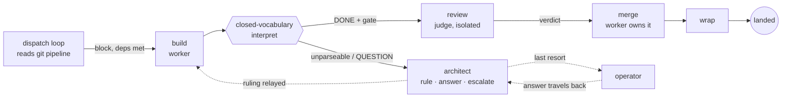
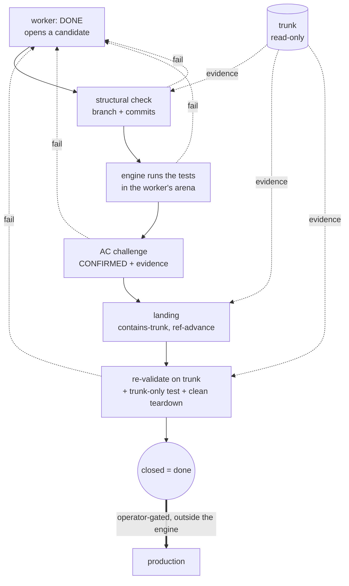

# Demoting the Master Control Program: Deterministic Orchestration of a Fleet of LLM Agents

> *"I fight for the Users."* — TRON (1982)

---

## Abstract

Multi-agent systems that build software usually coordinate their agents
*through* a language model: an orchestrator reasons in prose about who works
next, whether a task is done, and when to involve the human operator. That
puts a probabilistic component on the control path of a system whose value
depends on reliability, and it holds orchestration state inside a process that
cannot be safely interrupted. Recent work argues the inverse for a *single*
workflow: fix an explicit blueprint and confine the model to bounded steps
(Qiu et al., arXiv:2508.02721). We lift that paradigm to the harder problem of
orchestrating many concurrent, long-lived agentic builders, and present a
deterministic finite-state orchestrator in which a fixed dispatch loop
advances every unit of work by table lookup over a closed, lint-validated
vocabulary, and the model never chooses the next step. The claim is the
paradigm rather than the artifact. A deterministic control plane is built to
design out the coordination, long-horizon, and self-verification failures that
published work attributes to LLM-routed orchestration — a design claim we
ground in that failure literature, not in a head-to-head baseline (§15) —
while keeping the operator in contact through an agent they can talk to. The
central invariant: the model builds, but a deterministic gate decides done. We
trust neither the agent's report nor the commit.

We report a pre-registered campaign of 74 orchestrated delivery runs on one
immutable engine build (three ablation arms, a wide-parallelism arm, and a
main @2 configuration run to a clean target of 30, at 34 attempts), plus a
separate post-hoc 5-run PROJECT-04 extension (15 blocks, seven dependency
layers, nearly twice as wide and ~40% deeper). The headline reliability
configuration — PROJECT-03 main @2 — delivered 30 of 34 clean (88%, an
optional-stopping estimate). Across all 74 campaign runs — which also fold in
ablation and wide-parallelism arms, where walls are rare at this scale — 70
were clean, and the fixed-build extension delivered 5/5: every declared block
built, landed, and re-validated on trunk with zero operator intervention, each
product passing separate in-house probes. The four non-clean runs are reported
in full, and three never touched the engine's decision path: two were our own
test harness leaking state between trials and one was an external API outage.
The fourth was a real engine defect, since fixed with regression tests, and
even then the engine refused to fake a result. Every one failed safe: the
orchestrator escalated rather than close work it had not done, and under the
operator-dark protocol the run terminated there. The gate's rejection behavior
is shown directly by six by-construction false-done fixtures (five seeded
shortcuts and one trunk-only defect, on the fixed pin `v0.0.30` with engine,
gate, and vocabulary unmodified), all six rejected, none landed. Across the 79
delivery runs no worker ever attempted to close work it had not done, so the
0-of-79 false-completion count is observational: evidence about worker
behavior, not the gate under fire. The gate's strength is the 6-of-6, a small
adversarial sample, and the rule of three bounds the miss rate only at ≤50%.
No clean run needed the operator; the only pages were those four. When reality
misbehaved, the system said so instead of faking green. Beyond our own
benchmarks, the same runtime delivered clean on two MIT 6.5840 labs the
course specified and tested — MapReduce and the full Raft lab, 2 of 2 — a
first check that gate-decided *done* transfers to acceptance criteria we did
not write (reported separately, not pooled into the campaign rates; §15).

---

## 1. Introduction

Ask a team of LLM agents to build something real and the hard part is not the
building — it is the coordination around them: deciding who goes next, noticing
when one has silently died, telling a genuine "done" from an optimistic one,
knowing when the operator needs to weigh in. In most agentic frameworks that
coordination is itself done by a language model, a planner reasoning in prose
about the state of the world. The component you most need to be dependable is
the least dependable thing in the system: it can hallucinate a finished task,
forget a stalled worker, invent a step not in the plan; and because its state
lives in a running model's context, you cannot kill it and resume cleanly.

We did not set out to write an orchestrator. We set out to ship software with a
fleet of agents and kept hitting the same wall: a worker reporting success it
had not achieved, another dying unnoticed, a crash leaving the orchestrator's
idea of the world out of sync with the repository. The recurring failure — agents
declaring done on work that was not — we observed repeatedly before finding it
named in the literature (EviBound, arXiv:2511.05524).

Qiu et al. (arXiv:2508.02721) argued that for a *single* workflow you should
invert the usual design: write the plan as an explicit blueprint and let the
model do only bounded local work inside each step. Their setting is one
procedure of short, stateless, retryable nodes. We ask what it takes to hold
that line one level up, across a whole fleet of long-lived builder agents
(workers that persist for hours, carry session history, and can stall or die)
while a real project moves under them. The fleet setting breaks the
single-workflow assumptions in three places. State outlives the process: the
orchestrator will be killed and resumed. "Done" is contested: a worker's "done"
is a claim, and a commit on a branch is not a verdict either. And work runs
concurrently against a shared trunk, which makes coordination a
distributed-systems problem.

The engine we built once we accepted that the orchestrator itself had to stop
being a model is called TRON. Its central invariant is one line: the model
builds, but a deterministic gate decides done.

## 2. Contributions

1. Determinism at the fleet layer. Blueprint-first applied not within one
   procedure but *over* a fleet of long-lived sessions that *wall* (hit an
   unparseable reply, a failed gate, or a burned turn budget), stall, and
   die — and the machinery this forces (liveness, crash recovery,
   resume-vs-fresh, content-carrying escalation), all kept deterministic.
2. Git as an externalized state substrate. The orchestrator authors no content:
   no code, no plan edits, no test results. Each worker owns an isolated git
   worktree (an *arena*) and owns its own merge, and the engine's only write is
   the gated, contains-trunk land, a mechanical ref advance it authorizes but
   never fills. Crash- and drift-safety fall out of this rather than out of
   added recovery code.
3. Gate-decided done. Completion is closed by a deterministic challenge that
   rejects *both* self-report *and* bare trunk-presence: the engine checks the
   branch, runs the declared tests itself in the worker's arena, demands
   evidence for each acceptance criterion through a bounded challenge,
   re-validates on trunk after the landing, and runs a final trunk-only
   validation. Trunk is the gate's input at every step, never its verdict.
4. A parsed control plane, not a judged one. Every transition is a lookup over a
   closed, lint-validated vocabulary; the engine *parses* the agents' verbs, it
   never asks a model whether to advance. Judgment (triage, review, escalation
   copy) is confined to bounded LLM roles that sit off the steering path.
5. Reliability as a protocol property. Isolated arenas, a single engine-wide
   merge window, idempotent dispatch, and crash-safe ticks give the fleet
   distributed-systems guarantees — demonstrated in live crash-resume trials —
   and the safety property the design targets: no unearned claim ever closed
   work, 0 of 79 runs (observational, since no worker attempted a false
   close), with the gate's rejection shown *causally* by 6-of-6 forced
   false-done fixtures (§12.1; a small sample, bounding the miss rate only at
   ≤50%).

## 3. Principles (framework-agnostic; the engine instantiates them)

1. Closed vocabulary, deterministic interpretation. Agents speak a fixed
   glossary of verbs (`DONE`, `CONFIRMED`, `APPROVED`, `REJECTED`, `QUESTION`,
   …) generated from a single source and parsed by code. The control plane
   *parses*; it never *asks*. A message that breaks protocol is not guessed at.
   It routes to an in-fleet architect, an LLM by design, but a routed
   participant rather than a hidden judge. The engine cannot tell a mis-tagged
   wall from a real one, and must not try: the verb is the datum.
2. Gate-decided done. A worker's `DONE` opens a candidate, nothing more. The
   engine checks the branch itself, runs the project's declared tests itself in
   the worker's own arena, challenges the worker to confirm every acceptance
   criterion with evidence, re-validates on trunk after landing, and runs
   trunk-only validation at the end. Trunk is the evidence the gate checks at
   every stage, but neither a claim nor a commit ever closes work by itself
   (EviBound, arXiv:2511.05524, quantifies why: gating claims collapses
   false-completion from 100% to 0%).
3. Judge isolation. Verdicts are produced in a detached checkout pinned to the
   exact commit under review, force-restored to that SHA on every re-pin. The
   worker cannot move what the judge reads, and the judge cannot contaminate the
   arena.
4. Architect-first, content-carrying escalation. Walls route to the architect
   before the operator; an escalation channel is only as valuable as its
   *answer* path, so operator rulings travel back to the walled worker. Nothing
   is dropped or looped silently; the operator is the last resort.
5. Typed events as the only truth. Every dispatch, gate, verdict, landing, and
   trunk check is a typed event in an append-only log. All statistics below are
   computed from these logs, never from agent narration; the prose transcripts
   ride along only for debugging.
6. A frozen operator journey. The operator's decisions (models per role, merge
   policy, scope) are seated in a fixed bootup dialogue before autonomy begins;
   past that, the fleet is autonomous up to trunk, and the operator takes over
   past it.

## 4. Background & Related Work

Blueprint-first (arXiv:2508.02721, Qiu et al.) is the work this engine builds
on. Make source code the control mechanism and relegate the model to bounded
sub-tasks, the model being "never to decide the workflow's path", and
constraints become programmatic checks that cannot be bypassed. On
TravelPlanner they report 35.56% pass (+97.6% over their ATLAS baseline) and
−96.0% constraint violations. We lift this one level up — from one
deterministic *procedure* to a deterministic *fleet orchestrator* — where
nodes are long-lived sessions that wall, stall, and die (forcing liveness and
recovery they never confront), and where a sealed engine reads the pipeline as
data and authors no content — its only write is the mechanical land — rather
than fusing control and content in one artifact.

From Agent Loops to Structured Graphs (arXiv:2604.11378) reframes the agent
loop as a degenerate single-unit scheduler and prescribes lifting control flow
into an explicit static DAG with separated plan/execute/recover layers. It is a
position paper with no implementation; this engine is that thesis in running
code, git-driven rather than harness-owned.

MetaAgent (arXiv:2507.22606) is LLM-generated FSM control: soft, with every
transition hinging on a verifier LLM. The machine described here is hard, a
table lookup over a closed grammar, and the only model output the engine ever
consumes is the agents' verbs, never a transition. Hinging a transition on a
verifier LLM is fragile precisely because the LLM-as-judge is itself an unreliable
arbiter, with position, verbosity, and self-enhancement biases well documented
(Zheng et al., NeurIPS 2023), so we never let one decide a step.

EviBound (arXiv:2511.05524) is the closest match to gate-decided-done. Dual
governance gates collapse false-completion from 100% to 0% (pre-gate alone 25%
to 0%; ≈8.3% overhead). We push the analogue further — even a commit on
trunk is evidence to be checked, not a verdict — and we gate a *fleet*
arbitrating concurrent contributors through the shared trunk, where EviBound
governs a single agent's research claims.

Hack-Verifiable (arXiv:2605.20744) plants detectable reward-hacking
opportunities so exploitation is deterministically measurable. It is an
empirical case-file for the specification gaming the evidence gate neutralizes, and the
template for our by-construction false-done metric (§12.1).

Claw-Eval (arXiv:2604.06132) grades the *full trajectory* from execution traces,
audit logs, and snapshots; a vanilla LLM judge missed 44% of safety violations
against the evidence pipeline. It is our source for reporting consistency across
repeated runs rather than single-shot success.

LedgerAgent (arXiv:2606.20529) is a typed, schema-anchored ledger plus a
deterministic Allow/Revise/Block gate with zero extra LLM calls, independently
arriving at the same externalized typed state and pure-code admission, over a
private store rather than git trunk.

Atomix (arXiv:2602.14849) is progress-aware transactions that commit only once
per-resource frontiers confirm no earlier conflicting work can arrive. It is the
closest distributed-systems match (its commit-gate maps to the single merge
window plus contains-trunk check), but rollback-based where this design is
forward-only and ff-only-no-write.

Lean4Agent (arXiv:2606.06523) is dependent-type verification of agent workflows
(verification-passing workflows outperform by ~12%), an upgrade path for
the lint here: promote the transition table to *proof*.

Why multi-agent systems fail (MAST, arXiv:2503.13657, NeurIPS 2025) is a
1,600-trace study across seven frameworks that attributes ~79% of
multi-agent failures to specification and inter-agent coordination, so to
architectural causes rather than base-model capability. This is the empirical
core of the case: if the dominant failure is architectural, the remedy is
architectural — a deterministic control plane and an evidence gate — not a
stronger model in the orchestrator seat.

Long-horizon degradation is the premise evidence. Long-context reasoning falls
off before models reach their advertised limits: accuracy drops sharply when
relevant information sits mid-context (Lost in the Middle, TACL 2024) and
effective context runs well short of the advertised length (RULER, COLM 2024);
at 128K, frontier models score under 50% on aggregate-over-many-chunks reasoning
(Oolong, arXiv:2511.02817). Supervising a fleet *is* long-horizon aggregation,
which is the strongest external justification for keeping orchestrator state in
files and an FSM, and the mechanism-level prediction for why an LLM-orchestrator
degrades over a long session.

Positioning against frameworks. The defining axis is *who owns control flow,
and in what form*. LangGraph is a graph in code with edges often chosen by the
model; the design here is a validated blueprint in which the model never
decides flow. LangGraph is an agent framework, and this is a workflow engine
for agents, so its nearest relatives are durable workflow engines (Temporal,
Camunda/Zeebe). You could build a worker with LangGraph; building a
deterministic, auditable orchestration layer is not what LangGraph optimizes
for, since its edges are commonly model-chosen where these are parsed. Several
anchors cited above — arXiv:2604–2606 — are recent, still-unrefereed
preprints; we cite their reported figures as directional, not settled.

## 5. System overview: the deterministic core and the model's bounded roles

The engine orchestrates a pool of worker agents building against an explicit,
version-tracked plan, the *pipeline*, an ordered set of *blocks* (a block is one
unit of delivery work: a scoped task, its own spec file, its own branch, its own
gate). It does not write code and does not write to the repository.

The deterministic core is a fixed dispatch loop. It reads the pipeline from git,
selects dispatchable blocks (dependencies satisfied) up to a configured
parallelism cap, and runs each block through the *flow*, an ordered set of
phases declared in `workflow.toml`, the single source of the process. The engine
seats one agent per actor-and-persona and reuses it across that role's phases:
the worker that builds also owns its merge and wrap, and only the judge (a
*verdict* phase) is a fresh, isolated seat. A *work* phase closes on the actor's
declared verb after its gate; a *verdict* phase records a judge's verdict
durably and routes; the merge and wrap phases land inside the one engine-wide
merge window. Every advance is a deterministic interpretation of the seated
agent's reply against the closed vocabulary: the engine parses a verb and looks
up the transition, and it does not ask a model what to do next. A reply the
vocabulary cannot parse is not guessed at, but routed to the architect (§9).

The model therefore appears in exactly three bounded roles, none on the
steering path: workers build; judges review a delivered branch in isolation
and return a verdict verb; and an in-fleet architect (with an operator-facing
AIDE persona) triages walls and composes escalation copy. The model is the
untrusted component throughout; the trusted one is code. The engine is not
itself a model — it is plain code around the model — and the model is a
swappable part by design: any LLM or mix is meant to fill those roles under
the same sealed engine, though we exercise only one assignment and do not test
swapping. In this campaign workers and judges ran Sonnet 5 and the
architect/AIDE ran Opus 4.8, all seated through the frozen bootup journey, so
the results are entangled with those two specific models.

*Figure 1. The deterministic core: a block flows build, review, merge, wrap,
landed; every advance is a closed-vocabulary parse, the only decision point. The
architect is off the steering path, reached only by walls and unparseable
replies; the operator is the last resort and answers travel back to the walled
worker.*

## 6. The state substrate: git as external truth

The core owns no authoritative state and authors no content in version
control. Its only write is the gated, mechanical land (§7). Authorship and
landing are separate privileges. The single source
of truth about the work — which blocks are done, in progress, or next — is the
git-tracked pipeline, and the engine only reads it. Each dispatched block gets
an *arena*: an isolated git worktree on its own `feat/<block>` branch, created
off trunk. Workers can never collide in a shared tree, and trunk stays checked
out in the primary copy, so git itself refuses any second checkout of the
trunk. A verdict seat gets its *own* detached checkout pinned to the exact
delivered commit (judge isolation, §3).

Two properties fall out without recovery-specific code. Resume is a non-event:
at boot the engine kills stray agent processes, sweeps every leftover arena (a
crash-safe sweep added after this campaign surfaced the need, §15), preserves
any unverified in-flight branch as an orphan, and re-stamps interrupted blocks
back to `todo` for fresh dispatch. Drift halts loudly: an operation the engine
cannot complete safely pages the operator rather than acting on a stale view.

*Table 1. The three tiers of state, by durability and writer.*

| tier | what it holds | writer | lifetime |
|:--|:--|:--|:--|
| trunk | the authoritative plan + delivered work | workers author the content; engine performs the gated land (ref advance) | permanent |
| arena | one block's isolated worktree + branch | the block's worker | per-block, disposable |
| typed event log (`events.jsonl`) | every engine decision, one line each | engine | append-only audit trail |

Observability is by construction. In a deterministic runtime the trace is a
property rather than a bolt-on: `events.jsonl` (typed dispatch, gate, verdict,
land, and trunk-check records) *is* the audit trail, the control plane's
event-sourced record, and same-inputs to same-decisions makes it replayable,
which no probabilistic
orchestrator trace can promise.

## 7. The gate: what closes work

A worker announcing `DONE` opens a *candidate*. It advances only by surviving a
fixed challenge, in order:

1. Structural check. The engine verifies the claimed branch exists, is the
   block's own branch, and carries commits trunk does not. A claim for the wrong
   branch, or with no delivered work, is rejected outright.
2. The engine runs the tests. Where the block declares a test command, the
   engine runs it *itself* in the worker's arena and reads the real result; a
   red suite bounces the claim with the captured output. The worker never
   reports the test result. The engine observes it.
3. Acceptance-criteria challenge (bounded exchange). The engine challenges the
   worker to confirm every acceptance criterion with evidence. This challenge is
   its *own* bounded exchange: the only reply it accepts is a `CONFIRMED` verb
   carrying an evidence field, anything else is retried with the exact
   expectation, and exhaustion withdraws the claim back to work. (A defect in
   the campaign build let a failed challenge reply leak back into the phase
   loop, where `CONFIRMED` and `DONE` could each be read as out-of-phase,
   producing a deadlock. It surfaced once in the campaign as a failed-safe page,
   then was fixed by making the *inner verdict exchange* strictly bounded,
   distinct from the *outer* `DONE`/acceptance-challenge loop, still unbounded,
   A4 in §12.1; see §14 and §15.)
4. Landing. Inside the single engine-wide merge window, the worker owns the
   merge: it brings trunk into its branch and resolves conflicts in its arena,
   the engine verifies the branch already contains trunk (so the landing cannot
   conflict) and then performs the mechanical ref advance. An arena physically
   cannot move the checked-out trunk; the substantive merge work is the
   worker's, and the engine only authorizes.
5. Re-validate and close. The change is re-validated on trunk after landing; a
   final trunk-only validation runs where the block declares one; the worker
   confirms a clean teardown (the engine scans the arena for leftover state, a
   real read rather than say-so) before the slot is released.

Only after close does the block show done. The worker flow ends at trunk;
promotion to production is an operator action outside the engine. The subtle
point: trunk is the evidence the gate checks at every stage, but trunk-presence
alone never closes the work, which rejects the worker's *claim* and the naive
"it's on main, ship it" at once.

*Figure 2. The gate is a linear challenge; trunk is the evidence read into each
stage (dashed), never the terminal. Any stage can bounce the claim back to work.
Promotion to production is a separate, operator-gated step outside the machine.*

## 8. Reliability as a protocol

Coordination is a distributed-systems problem, so we give it
distributed-systems guarantees. Arena isolation: every block builds in its own
worktree and branch, and concurrent workers cannot corrupt one another's trees.
One merge window engine-wide: at most one landing is in progress at a time, and
a landing is admitted only once the engine has confirmed the branch contains
trunk, so concurrent contributors serialize through the trunk without
conflicting. Idempotent dispatch: a block already in flight is never
double-assigned. Crash-safe boot: strays are killed, arenas swept, in-flight
branches orphaned, and interrupted blocks re-queued, so a killed and restarted
engine reconverges to trunk with nothing lost, doubled, or double-dispatched.
The typed event log makes each of these auditable after the fact, and replayable
before.

This is validated by four deliberate live trials, not only unit tests
(`evidence/crash-resume.md`): the engine was hard-killed (SIGKILL) mid-flight
and restarted on the same project. A single-block run killed during build
preserved the unverified branch as an orphan, re-queued it, and completed. A
six-block run killed with three landed and two building kept the three land
commits exactly (not rebuilt), orphaned and re-queued the two in-flight, and
reconverged to 6/6. An eight-block depth-5 graph killed after three landings
kept all six pre-crash land commits (two per landed block) as trunk ancestors
and re-queued the two independent in-flight branches (8/8). And a run killed
with two workers building in parallel orphaned both in-flight branches and swept
their arenas independently, with no double-landing (6/6). Every trial's product
suite came back green: nothing lost, doubled, or dropped, sequential or
concurrent.

## 9. Escalation: architect-first, content-carrying, no second judgment

When something does not fit the vocabulary, a reply the engine cannot parse, a
gate the worker cannot pass, a phase that burns its turn budget, the core does
not ask the model a second question ("is this the operator's problem?"). It
routes the wall to a persistent in-fleet architect (an LLM with project context)
that does one of three things: it rules on the wall and relays the ruling back
to the seat; it answers it, so questions never dead-end; or it escalates to the
operator with content. A ruling that comes back a second time, a wall that
recurs after being answered, skips straight to the operator, since an answered
wall that returns is above the fleet. Operator answers are content-carrying: the
ruling travels back to the walled worker, because an escalation channel is only
as valuable as its answer path. The engine's own turn continues and the reply
lands on a later turn. All wall kinds route architect-first; the operator is the
last resort.

## 10. Relationship to existing tooling

The design overlaps durable workflow engines and stateful agent frameworks: a
graph or state machine as the unit of orchestration, durable state and resume,
operator-in-the-loop as a parked and resumable wait, typed I/O, observability
ambitions. It is fundamentally incompatible with model-routed frameworks:
blueprint-routed against model-routed control; an auditable process definition
against a code graph whose edges the model chooses; external, long-lived
git-branch sessions against in-process nodes; git-as-truth against app-internal
state; evidence-gated done against "correctness is the app's problem". What we
would borrow: a checkpointer formalism to sharpen resume edge-cases,
durable-execution semantics as a tick checklist, tracing tooling for the
*experiment* harness kept outside the production spine. What we would not:
model-decided routing, graph-as-code as the source of truth, any coupling that
moves state off the trunk.

## 11. Campaign design

### 11.1 What a block is

The unit the engine schedules, builds, judges, and lands is a *block*: one
self-contained delivery spec (a Markdown file) that names what to build,
declares the test that certifies it, and lists its dependencies, a contract
precise enough that a fresh builder with no prior context can satisfy it and a
deterministic gate can decide whether it did. Every block has the same shape: a
title, a `test:` line, an optional `trunk-test:` line (the suite that must pass
on the *merged* trunk, not only the isolated arena), and a numbered task list
written as verifiable obligations (exact error strings, return shapes, ordering)
rather than intentions. Because the block *declares its own test*, the engine
never guesses what "done" means. Ambiguity is designed out at authoring time,
not adjudicated at review time.

We author blocks to five principles. Spec-driven: exact observable outcomes, not
a direction to explore, so if two builders could satisfy the text differently it
is under-specified and gets rewritten. Architecturally coherent: one module or
CLI surface, one landing, one place in the dependency graph, so layer boundaries
are block boundaries. Short-memory-sized: context engineering at the unit of
work, since it fits inside one builder's context, so long horizons are
expressed as more blocks rather than bigger blocks. One
branch, one gate: never split across blocks, never partially landed. And
declares its own test: behavior lands *with* its test, which the engine runs
itself in isolation. The dependency graph (`pipeline.md`) is what the scheduler
consumes by ready-set selection, and blocks with satisfied dependencies run in
parallel up to the
configured width, with a shared contract file (for example `MODULES.md`) the
deliberate merge-contention surface.

### 11.2 The sample

One immutable engine build (tag `v0.0.29`) ran the entire campaign, so results
are comparable. Three project templates of increasing difficulty: PROJECT-01 (3
blocks, a stack library, pilot only, deliberately absent from the sample because
a 3-block smoke test exercises no contention or parallelism), PROJECT-02 (6
blocks, a collections toolkit with a shared module file that forces merge
contention), and PROJECT-03 (8 blocks across five dependency layers, an issue
tracker with a rank/report CLI, the headline configuration). The sample was
operator-ruled in advance and never self-expanded.

*Table 2. The pre-registered sample (operator-ruled in advance; `n` is the
target run count, `@N` the parallelism cap).*

| config | n | purpose |
|:--|--:|:--|
| PROJECT-02, ablate `truth_gate` | 10 | falsification arm: worker claims accepted unverified |
| PROJECT-02, ablate `judge_isolation` | 10 | falsification arm: judges read the worker's arena |
| PROJECT-02, ablate `architect_first` | 10 | falsification arm: walls page the operator directly |
| PROJECT-03, parallel @4 | 10 | scheduler under widest parallelism |
| PROJECT-03, main @2 | 30 | headline reliability estimate |

The `n` column is the operator-ruled *target* (70); the campaign logged 74
attempts because main @2 ran 34 to reach its 30-run target (the four non-clean
runs are attributed, not dropped, in §12).

The evaluation is deliberately adversarial to the system's own comfort. Runs
execute operator-dark: pages are left unanswered on purpose, and any page caps
the run, because the bar is *unattended* delivery and the campaign cannot "pass"
by leaning on the operator. Separate in-house per-product probes sit *outside*
the harness verdict: a fresh `python3 -m unittest discover` in every delivered
product, plus a live CLI transcript on PROJECT-03 checked against the spec's
exact output. Batches ran ~10 at a time, ablations first (cheapest
falsification), at most two concurrent runs, with an operator review between
batches. Two pinned worktrees isolated concurrent runs because arenas and run
logs live in the engine root.

## 12. Results

Reported by build, not pooled into one rate: the pre-registered campaign
(build `v0.0.29`, 74 runs) delivered 70 clean, and its headline reliability
configuration, PROJECT-03 main @2, delivered 30 of 34 (88%, an
optional-stopping-biased estimate); the separate PROJECT-04 extension on the
fixed build (`v0.0.30`, 5 runs) delivered 5/5. Every delivered product passed
its separate in-house probes. The one property that holds on every run
regardless of build — false completions — numbered 0 of 79 (0%; observational,
§12.1). We report the complete attempt-level accounting rather than a filtered
"valid" subset: the safety property the design exists to guarantee is that a
claim never closes work it did not do, and that property is only meaningful
over *every* run, including the ones that went wrong. Separately, on two
benchmarks we did not author — MIT 6.5840 MapReduce and Raft — the runtime
delivered clean 2/2; that external-validity probe is kept out of the rates
above and detailed in §15.

The four non-clean runs, in full. All four occurred in the PROJECT-03 main @2
configuration. Three of the four are not the engine's decision behavior at all:
two are our own test harness leaking state between trials and one is an external
API outage, so only one traces to the engine under test, and even it failed
safe. None produced a false completion; each failed safe, in that the engine
escalated and the run capped only because the page went unanswered under the
operator-dark protocol.

*Table 3. The four non-clean runs, attributed by layer.*

| run | attributed cause | layer | independent engine trial? | outcome | status |
|:--|:--|:--|:--|:--|:--|
| batch-04 SIM-04 | Anthropic API 529 (overloaded) mid-review | external infrastructure | yes | no verdict, routed architect-first, paged, capped 5/8 | external; not an engine fault |
| batch-04 SIM-05 | stale-arena poison (left by SIM-04's cap) | test harness | no, contaminated precondition | paged on "arena exists", capped 4/8 | harness defect, fixed post-campaign |
| batch-06 SIM-01 | gate-vocabulary deadlock (`CONFIRMED`/`DONE`) | engine under test | yes | 4 rejections, escalated, paged, capped 6/8 | engine defect, fixed post-campaign |
| batch-06 SIM-02 | stale-arena poison (left by SIM-01's cap) | test harness | no, contaminated precondition | 6 blocks done, paged on block-07 "arena exists", capped 6/8 | harness defect, fixed post-campaign |

Three of the four are not evidence about the engine's decision behavior: one
is an external API outage, and two are our own harness leaking state between
trials. Each of those two started from a corrupted precondition (an arena
directory left by the *previous* run's cap) that the engine never produces in
normal operation, so they are not independent draws from the engine's behavior
distribution. The two harness losses are themselves not independent: both
trace to one root — a capped run left a poisoned arena that then failed the
*next* run — so they are a single harness defect with two cascading run
losses, and that cascade is itself a real operational failure of the
harness-as-run rather than a neutral exclusion. We still count them, since
dropping them is precisely the move that invites doubt: within the campaign
build (`v0.0.29`), 3 of the 4 non-clean runs lie outside the engine's decision
path — one external outage, two harness — and only 1 traces to the engine
under test. We report that attribution rather than a second, higher clean-rate
percentage, because quoting an "engine-only" rate would launder the harness
losses out of the number. The one non-clean run attributable to the engine
under test is the gate-vocabulary deadlock: a real defect on the engine's own
control path, where the engine still refused to fake a completion and
escalated instead.

On the headline reliability bound. The PROJECT-03 main @2 configuration saw 34
attempts, 30 clean (88%); because the configuration was run to a clean target of
30 (optional stopping), the naive 88% is biased upward, and we read it as a
lower-confidence estimate. We do *not* claim a zero-failure clean-completion
rate there, since the harness and one engine defect cost clean completions that
the fixes have since addressed. What we *do* claim, and what the design targets,
is the safety property: 0 false completions across all 79 runs. That 0/79 is
observational rather than a stress test, because no worker attempted a false
close, so pooling all 79 is fair (false-completion must hold on *every* draw
regardless of topology) but the count says more about worker behavior than about
the gate. The gate's rejection behavior is measured directly by the six
by-construction fixtures below (§12.1): 6/6 caught, which by the rule of three
bounds the miss rate only at ≤50%, a weak bound we state honestly rather than
dress the 0/79 up as a sub-4% guarantee. We keep pre-registration separate for
the *reliability* rate, where it does matter.

### 12.1 Causal supplement: the gate made to catch

The 0/79 result is *observational*: across all 79 runs no worker ever tried to
close work it had not done, so the gate's rejection behavior was never
exercised. Two follow-up experiments on the fixed pin (`v0.0.30`) force the
events the runs never produced. Both seed only the worker instruction channel;
the engine, gate, and vocabulary are unmodified (`evidence/EXPERIMENTS.md`).

Experiment A, the false-done testbed (n=5). Five single-block fixtures each
seed one deliberate shortcut, spanning the ways a claim can lie: (A1) DONE
with nothing committed, (A2) DONE with a deliberately failing test, (A3) DONE
after deleting the named test, (A4) a bare `CONFIRMED` with no evidence at the
acceptance challenge, (A5) DONE whose arena suite is green but whose declared
trunk obligation is broken. Result: 5 of 5 rejected, 0 landed (no `block_done`
on any run), each caught at the earliest applicable stage (A1 structural
check, A2 and A3 the engine's own arena test run, A5 trunk-only
re-validation), converting the observational safety property into a causal
one. The six fixtures (these five plus Experiment B) exercise four distinct
gate stages — structural, arena-test, acceptance-challenge, and trunk-only —
not six independent mechanisms, so we report 6/6 as coverage of those stages
rather than as six unrelated trials. A4 was also rejected but exposed a
liveness shortcoming: the outer `DONE`/acceptance-challenge loop is not
bounded to a terminal escalation, so a worker that persistently withholds
evidence drives the run to its wall-clock cap rather than a clean operator
halt. Safety held; liveness degraded, a hardening target (bound the outer
loop; escalate an unresolved architect wall to the operator) that 75 clean
runs never reached.

Experiment B, the trunk-only fixture (n=1, deterministic). A change whose
in-arena unit test mocks its collaborator is green in isolation but breaks the
real integration on the merged trunk. The engine landed the branch, re-ran the
suite green, then ran the block's `trunk-test:` on the trunk, observed RED, and
refused to stamp the block done, paging instead. This is the on-record negative
case that trunk re-validation is not redundant with arena testing: an
integration defect no isolated arena can observe is caught at the trunk.

Together these make the central claim causal rather than incidental: across 79
observational runs *and* six forced-shortcut trials, no unearned claim ever
closed work.

Operator time displaced. A per-decision response-time model (dispatch 2 min,
gate 1, verdict 5, land 2, trunk-check 1) applied to the typed event logs
yields 7,835 modeled minutes (~130.6 h) of decision-work performed by the
engine across the campaign. The per-decision minutes are assumed constants,
not measured, and carry no sensitivity analysis; the total scales linearly
with them, so read ~130 h as an order-of-magnitude illustration of
displaced operator attention rather than a measurement. Workflow-triggered
operator interventions in the clean runs: 0. The system did contact its
operator — at the designed, project-specific touchpoints (bootup choices,
landing policy) — but no clean run needed the operator to unblock the
workflow, and the only pages raised were the four non-clean runs above.

## 13. Ablations (event-level; pass/fail does not discriminate)

All 30 ablated runs finished clean. Walls are rare at this scale, so pass/fail
does not discriminate the arms. Discrimination is therefore event-level
(`evidence/ablation-analysis.md`):

- `truth_gate` off is the only arm with a behavioral delta: across the arm,
  180 of 180 work-phase gate checks (build, merge, and wrap across the 60
  blocks) emitted "claim accepted unverified"; the non-ablated work-phase gate
  catch rate is roughly 5–7% (applied to those 180 checks, ≈9–13 statistically
  expected catches suppressed); and ablated runs ran ~15% faster, so
  verification is real, measurable work. These are point estimates over n=10
  arms with no confidence interval, to be read as indicative magnitudes rather
  than precise rates. At n=10 the removed invariant was not product-fatal, so
  we report it as bounded rather than zero risk, without overclaiming a
  disaster that did not occur.
- `judge_isolation` off: no measurable contamination signal at n=10. We log the
  instrument gap honestly, in that verdicts do not currently record their
  read-source, so contamination is under-instrumented rather than proven absent.
- `architect_first` off: never exercised, since zero walls occurred in the arm,
  so routing walls directly to the operator was never triggered. The
  architect-first claim rests on the incident evidence (§9, §12) and not on this
  arm, and we say so rather than stretch a null result into support.

## 14. Evidence from the development record (honest exhibits)

The engine is a ground-up rewrite whose design was selected by its
predecessor's failures, itself evidence for the thesis at the code level. These
are retrospective observations from the predecessor's development record,
narrative exhibits rather than statistics drawn from the audited campaign event
logs:

- Convergence on determinism under selection pressure. In the predecessor, the
  observable-reading regions (dispatch, work selection, trunk refresh) almost
  never failed, while the message-interpreting periphery (wall/hold/replay,
  settle, admission, liveness) absorbed *all* ~13 fix-blocks at 4–8× the
  defect-scar density. Every independent fix moved a decision from
  interpretation to observation: the system converged on determinism under
  pressure from its own failures.
- Probabilism as unbounded flow variance. Two runs of the same sim, same sha,
  same knobs, one second apart: one finished in ~67 min; the other drew a
  strict-compliance worker that refused an ambiguous merge instruction, re-sent
  its wall 18 times, and still stood at 2/4 when its twin finished, a
  substantial but bounded wall-clock penalty from one sampled interpretation of
  one sentence. Determinism contained what it could not remove: every message
  survived, the sweeps re-raised what the parser missed, and the cost was
  bounded and forensic.
- A live false-completion, and this campaign's own incident. In the predecessor,
  one block recorded done while a mandated commit sat off trunk, our own
  EviBound failure mode, from a single boundary that trusted a report; the fix
  (gate on the *absence of counter-evidence*) closed the class and is why the
  rewritten gate never treats a claim as terminal. In this campaign the gate
  once deadlocked (`CONFIRMED` and `DONE` each rejected for the other after a
  failed challenge reply leaked into the phase loop); the escalation chain
  worked and the run capped only because pages go unanswered, the one
  engine-attributable non-clean run (§12), and the exchange has since been made
  strictly bounded, so the ambiguity is unrepresentable.
- Negative results that generalize. Workers do not comply with
  structured-envelope protocols even when contractually ordered (design for
  non-compliance; derive from observables). Freezing *vocabulary* does not stop
  *mechanism* accretion. The operator is part of the system under test, and
  operator-layer slips need the same discipline as the machine side.

## 15. Limitations & claim hygiene

- Scale. The campaign used 6–8-block constructed projects designed to force
  contention and judging pressure, not a shipped product. For external
  validity we ran PROJECT-04 (on the fixed pin `v0.0.30`) — a 15-block
  log-structured key–value store, seven dependency layers, two join diamonds
  (nearly double the width, ~40% deeper) — which delivered clean 5/5
  (15/15 blocks each, zero walls, zero pages, ~35–42 min/run, product suite
  green on durability and log-compaction CLI probes). That is evidence the
  discipline holds at a deeper, wider topology, not a claim of production
  scale: topologies an order of magnitude larger, or with real external
  dependencies, remain unprobed.
- Self-authored benchmarks and self-declared tests. Every project and its
  tests were authored by us to the five principles of §11.1, and the gate
  decides done by running those self-declared tests, so *gate-decided done
  relocates trust to the test-author rather than removing it*. On these
  targets ambiguity is designed out at authoring time; real software rarely
  arrives so pre-formalized, and none of these results transfer to acceptance
  criteria we did not write. As two probes beyond our own benchmarks, we ran
  MIT's 6.5840 labs through the same runtime, with the specifications and the
  tests authored by the course, and done decided by its unmodified `go test`
  suites, and both delivered clean: 2 of 2 on third-party oracles we did not
  author (kept separate from the campaign rates of §12, not pooled into them).
  Lab 1 (MapReduce) delivered clean first try: build gate green, review
  approved on the first cycle, no walls, no operator pages. Lab 3 (Raft), the
  course's hard distributed-systems lab (leader election, log replication,
  persistence, and snapshots), graded by its own 28-test suite across four
  cumulative parts (3A–3D), delivered clean in a single orchestration run with
  all four parts passing: each built, was approved on the first review cycle,
  and re-validated on trunk, with zero operator pages and zero walls. We
  re-verified both independently on fresh checkouts, Raft passing all 28 tests
  under the course's canonical build, and again with zero data races under
  Go's race detector, and in each the worker edited only the surface we
  declared editable (`raft.go` alone, for Raft), authoring no acceptance
  criteria and leaving the course's harness byte-for-byte intact. Each lab is
  a single orchestration run (n=1), not a repeated-trial reliability estimate;
  we did not attempt the intervening Lab 2 (a single-server key/value store),
  so the two we report bracket the course's range — introductory and hard —
  rather than sampling it. Both runs are reported outside the campaign totals
  of §12; they are two points of transfer to specifications and test suites we
  did not author — not a generalization claim — and larger topologies with
  real external dependencies at production scale remain the next step.
- Requires complete, well-specified inputs. The guarantees assume each block
  arrives as a precise, self-contained specification: exact acceptance
  criteria, a declared test the engine can run, and every dependency and asset
  present in the scaffold before dispatch. Because the engine gates on
  evidence rather than intent, an under-specified block, a missing asset, or a
  scaffold whose declared test cannot run on a fresh trunk checkout does not
  degrade gracefully. It walls or halts rather than improvising. The engine
  front-loads the work of authoring a sound scaffold; it does not substitute
  for it. The MapReduce probe above made this cost concrete. Although the
  course wrote the specification and the tests, running them under the engine
  still required us to author a self-contained, deterministic gate: it builds
  the plugins the tests load and the binaries they exec, then runs the suite
  under a timeout, needed because an empty implementation *hangs* rather than
  fails. We also had to provision the language toolchain before dispatch and
  declare the editable surface. The acceptance criteria were given; their
  runnability was still ours to engineer. Relatedly, a small set of fatal
  conditions — a landing that leaves trunk red, an arena that cannot be
  created — halt the run loudly and do not accept an in-flight operator patch;
  recovery is to fix the specification or scaffold and restart (crash-safe
  boot re-dispatches), or to remediate in a new block ahead. At these fatal
  prompts the operator channel is deliberately degenerate: it accepts only
  `abort`, not the bidirectional, content-carrying escalation of §9, so an
  operator instruction to repair in place (for example "delete the arena and
  retry") is not executed and the run halts and waits. Live, in-place repair
  of a broken trunk is deliberately out of scope, and is a hardening target.
- All attempts reported. We attribute the four non-clean runs by layer rather
  than dropping any (§12); the operational ledger's "valid run" count drove
  batch-stopping only, so the rates cannot be read as cherry-picked.
- No head-to-head LLM-orchestrator baseline. We do not race an LLM in the
  orchestrator seat against the deterministic runtime; the `architect_first` arm
  is the nearest control and went unexercised (walls were rare at this scale, so
  that claim is scoped to incident evidence, §9, §12). We make no superiority
  claim from our own runs. The positioning is literature-grounded: the failure
  modes published work attributes to LLM-routed orchestration, specification and
  coordination failures shown to be architectural rather than model-scale (MAST,
  NeurIPS 2025), long-context aggregation degradation (Lost in the Middle, TACL
  2024; RULER, COLM 2024), and unreliable LLM self-judgment (Zheng et al.,
  NeurIPS 2023), are precisely the ones this design is built to preclude on the
  control path by construction. A controlled bake-off is left to future work.
- The operator-time metric is modeled, not measured. The model and the event
  logs are published (see *Data and code availability*).
- Model/API dependence. Results are tied to the seated models; one 529 outage
  cost a run. Environment failures are named as such and kept out of the *rates*,
  never out of the accounting.
- Remediation, not folded back. The two defects — the gate-vocabulary deadlock
  (now a bounded exchange with four scripted regression proofs) and the
  stale-arena harness poison (a crash-safe boot sweep with selftests) — were
  root-caused and fixed on `v0.0.30` immediately after the campaign, with a
  one-run-per-level validation pass (distinct from the PROJECT-04 extension)
  confirming clean delivery on the fixed build; the paper's numbers are the
  campaign's, on `v0.0.29`. The by-construction false-done testbed
  (Hack-Verifiable), earlier deferred, has since been run (§12.1): 5/5 seeded
  shortcuts rejected, 0 landed, plus the deterministic trunk-only fixture, and
  it surfaced one liveness shortcoming (the unbounded outer
  acceptance-challenge loop, A4), logged for hardening. Remaining future
  instruments: a read-source field on verdicts (to close the `judge_isolation`
  gap) and promoting the lint to proof (Lean4Agent).
- Claims target the orchestration layer, not worker code quality, and
  procedurally well-defined delivery work, not open-ended exploration.

## 16. Conclusion

Taking the model off the control path and gating truth on the repository makes
an autonomous fleet auditable, recoverable, and runnable unattended. Across a
pre-registered 74-run campaign on one pinned build (`v0.0.29`) — plus a
post-hoc 5-run PROJECT-04 extension on the fixed follow-up pin — the fleet
delivered clean end to end (campaign 70/74, extension 5/5), every product
separately verified in-house, with zero operator interventions in the clean
runs and — the property that matters most — not one false completion across
all 79 runs, including on the run where the engine's own gate hit a defect and
still refused to fake green, and with the gate's rejection behavior shown
directly by six forced false-done fixtures, all six caught (§12.1). The model
keeps doing what it is good at: workers build, judges judge in isolation, the
architect and AIDE talk. What the model no longer does is decide. The model
builds, but a deterministic gate decides done.

## Data and code availability

The engine-emitted ground truth for every run (typed `events.jsonl`), the
engine-written run reports, and the deterministic process definition the
engine executed are published at `github.com/4242labs/tron` under `paper/`,
alongside the maintained engine itself and the by-construction false-done
fixtures of §12.1 (runnable against the current build). The archive is for
inspection and audit rather than reproduction by re-execution: worker and judge steps are
stochastic LLM calls, and the campaign ran on an earlier pin of this engine —
a predecessor version line since evolved into the maintained public build — so
the published record and not a re-run is the evidence. Pilot and warmup runs
excluded from the reported counts are enumerated alongside the data. The
third-party probes (MIT 6.5840 Labs 1 and 3) are documented by their engine
decision logs and pre-run scaffolds; the worked solutions are withheld — the
course prohibits publishing lab solutions and the starter is the course's
copyright — but the benchmarks are public and citable, so each experiment can
be re-set-up from its scaffold against the course's own starter, subject to
the same stochastic-LLM caveat as every run above. The operator-time figure is
a model applied to the event logs (§12.1), not a measurement.

## LLM Usage Statement

This project used LLM assistance for literature collation, drafting support, and
adversarial self-review. The system under study orchestrates LLM worker agents,
and every quantitative result reported here is computed from the engine's typed
event logs rather than from any agent's narration. All quantitative claims and
citations were verified against the primary sources; where a secondary source
and a primary paper disagreed, the primary paper governs. The author reviewed
and edited the final manuscript and owns its argument and framing.

## Notes for typesetting

Figures 1 and 2 render from `mkfigs.py` in the 42labs vector style; Table 1 is
native. All citations verified to resolve.

**References** (arXiv IDs verified to resolve; exact published titles).

1. Qiu et al., *Blueprint First, Model Second: A Framework for Deterministic LLM Workflow*, arXiv:2508.02721.
2. Chen, *Evidence-Bound Autonomous Research (EviBound): A Governance Framework for Eliminating False Claims*, arXiv:2511.05524.
3. Hu Wei, *From Agent Loops to Structured Graphs: A Scheduler-Theoretic Framework for LLM Agent Execution*, arXiv:2604.11378.
4. Zhang et al., *MetaAgent: Automatically Constructing Multi-Agent Systems Based on Finite State Machines*, arXiv:2507.22606 (ICML 2025).
5. Mohammadi et al., *Atomix: Timely, Transactional Tool Use for Reliable Agentic Workflows*, arXiv:2602.14849.
6. Uddin et al., *LedgerAgent: Structured State for Policy-Adherent Tool-Calling Agents*, arXiv:2606.20529.
7. Roth et al., *Hack-Verifiable Environments: Towards Evaluating Reward Hacking at Scale*, arXiv:2605.20744.
8. Wang et al., *Lean4Agent: Formal Modeling and Verification for Agent Workflow and Trajectory*, arXiv:2606.06523.
9. Ye et al., *Claw-Eval: Towards Trustworthy Evaluation of Autonomous Agents*, arXiv:2604.06132.
10. Bertsch et al., *Oolong: Evaluating Long Context Reasoning and Aggregation Capabilities*, arXiv:2511.02817.
11. Cemri et al., *Why Do Multi-Agent LLM Systems Fail?*, arXiv:2503.13657 (NeurIPS 2025 Datasets & Benchmarks).
12. Liu et al., *Lost in the Middle: How Language Models Use Long Contexts*, TACL 2024 (arXiv:2307.03172).
13. Hsieh et al., *RULER: What's the Real Context Size of Your Long-Context Language Models?*, COLM 2024 (arXiv:2404.06654).
14. Zheng et al., *Judging LLM-as-a-Judge with MT-Bench and Chatbot Arena*, NeurIPS 2023 (arXiv:2306.05685).
15. LangGraph, Temporal, Camunda/Zeebe: project docs for the §4 contrast.

